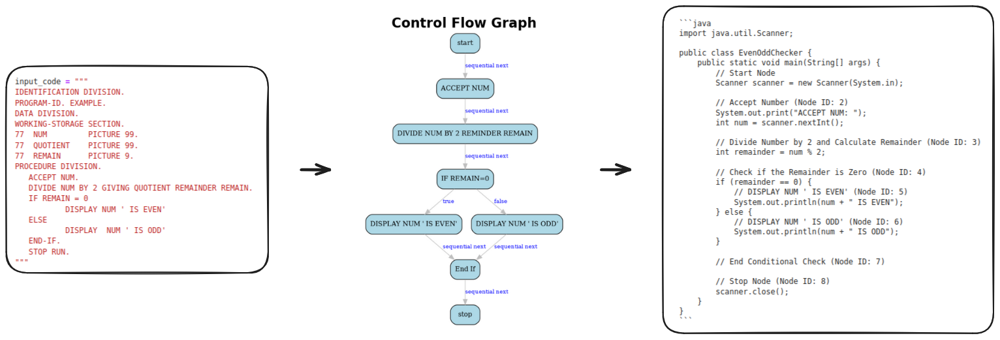

# lr4lg

Language Recognition for Language Generation

    

- To generate a lexer and parser from an ANTLR grammar file, you can use the following command: `antlr4 -Dlanguage=Python3 -visitor <YourGrammarFile.g4>` or `antlr4 -Dlanguage=Python3 <YourGrammarFile.g4> -o <YourFolder>`

# references

[Project_CodeNet](https://github.com/IBM/Project_CodeNet)

[human-eval](https://github.com/openai/human-eval)

[COBOLEval](https://github.com/zorse-project/COBOLEval)

[grammars-v4](https://github.com/antlr/grammars-v4)

[proleap-cobol](https://github.com/uwol/proleap-cobol)

[proleap-cobol-parser](https://github.com/uwol/proleap-cobol-parser)

[opensource-cobol](https://github.com/opensourcecobol/opensource-cobol)

[EnterpriseCOBOLv6.3](https://github.com/cchipman21804/EnterpriseCOBOLv6.3)

[COSPEX](https://github.com/Naxs-me/COSPEX)

[COBREX-CLI](https://github.com/rishalab/COBREX-CLI)

[llama-recipes](https://github.com/meta-llama/llama-recipes)

[alignment-handbook](https://github.com/huggingface/alignment-handbook/tree/main)